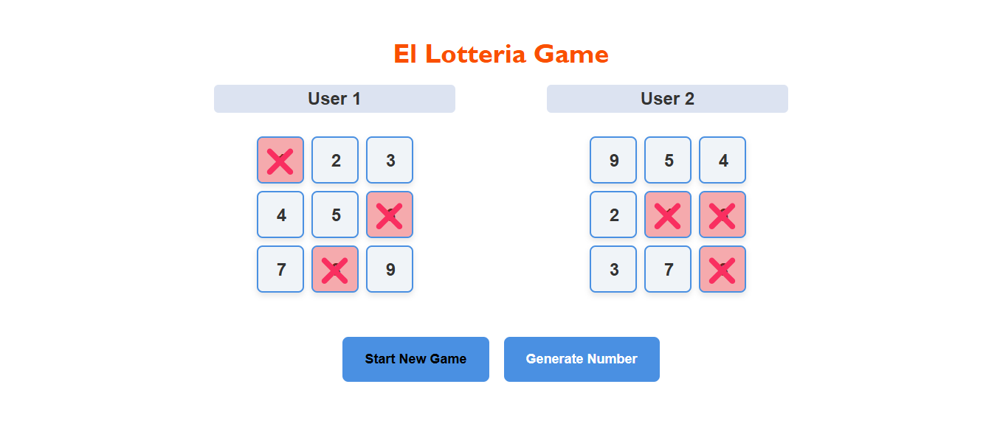

# Mexican-game-El-Lotteria


# **El Lotteria Game 🎲**  

A real-time multiplayer lottery-style game built using the **MERN stack** and **Socket.io**, where two players compete by filling 3x3 grids with unique numbers. The game randomly generates numbers, and the first player to complete a row or column wins.  

## 🚀 Features  
- **Real-time gameplay** powered by **Socket.io**.  
- **MERN stack** implementation for a full-stack experience.  
- **Interactive React UI** with dynamic grid updates.  
- **MongoDB change streams** to track and validate winning conditions.  
- **Input validation** to prevent duplicate/incomplete grids.  
- **Live winner announcement** and automated game state updates.  

## 🛠 Tech Stack  
- **Frontend:** React, Axios, TailwindCSS  
- **Backend:** Node.js, Express, MongoDB, Socket.io  

## 🎮 How to Play  
1. Two players enter unique numbers (1-9) in their respective 3x3 grids.  
2. Click "Start Game" to begin.  
3. A random number is generated, and matching numbers are marked off automatically.  
4. The first player to complete a row or column wins!  

## 📂 Installation  
1. Clone the repository:  
   ```bash
   git clone https://github.com/someswar177/Mexican-game-El-Lotteria.git
   ```
2. Install dependencies for both frontend and backend:  
   ```bash
   cd backend && npm install  
   cd ../frontend && npm install  
   ```
3. Start the backend server:  
   ```bash
   cd backend && npm start  
   ```
4. Start the frontend:  
   ```bash
   cd frontend && npm start  
   ```
5. Open the game in your browser at `http://localhost:3000`  

## 🌐 Live Demo  
🔗 [Play Now](https://mexican-game-el-lotteria.vercel.app) 